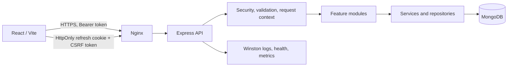

# Architecture

The repository uses npm workspaces: `backend` for the Express API and `frontend` for the React client.

The API is mounted at `/api/v1`. Each backend domain module owns its routes, controller, service, repository, validator, Mongoose model, and tests where applicable. Controllers handle HTTP concerns, services enforce business rules, and repositories isolate persistence.

The platform currently implements a secure authentication lifecycle for registration, login, refresh, logout, password reset, and email verification. Access tokens are short-lived JWTs, while refresh tokens are opaque values rotated on each refresh and stored as hashed records with family-based revocation. Protected routes rely on authentication and role-based authorization middleware.

The backend follows a feature-based architecture with a thin HTTP layer, a service layer for orchestration, and repositories for database access. Shared cross-cutting concerns such as validation, logging, and centralized error handling are applied consistently across modules.

